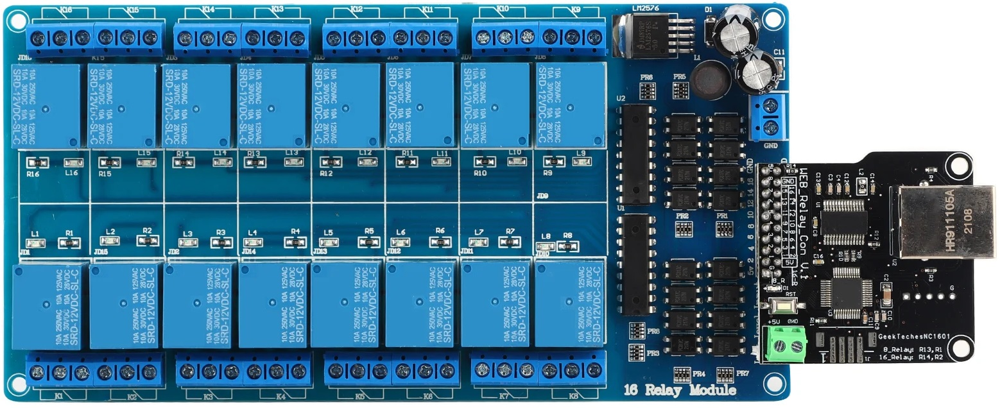

# HTTP Multi-Channel Relay for Home Assistant

[English](#english) | [Русский](#русский)

---

## English Description

Integration for controlling relay modules via HTTP. Optimized for controllers with specific command indexing (00/01) and HTML-based status pages.

### Features
- **Plug & Play**: Easy setup via the Home Assistant UI (Config Flow).
- **Dynamic Configuration**: Supports 4, 8, or 16-port devices.
- **Status Sync**: Feedback using the `/99` status command.
- **Device Grouping**: All relays are grouped under a single Device card.
- **Dynamic Config**: Change **IP, Port, and Scan Interval** via the "Configure" button without restarting HA.
- **Efficiency**: Uses `DataUpdateCoordinator` (1 request updates all channels).
- **Smart Naming**: Auto-generates Entity IDs based on your prefix.

### Command Logic
- **ON**: `http://<IP>/<PORT>/<Index>` where `Index = (Channel * 2) - 1` (01, 03, 05...)
- **OFF**: `http://<IP>/<PORT>/<Index>` where `Index = (Channel - 1) * 2` (00, 02, 04...)
- **Status**: Polls `/99` page and parses the `0/1` string from the link text.

### Installation
1. Open **HACS** -> Custom repositories.
2. Add URL: `https://github.com/KrolikROJER/ha-16-channel-relay`
3. Category: **Integration**.
4. Install "HTTP Multi-Channel Relay" and **restart HA**.

---

## Русский (Russian)

Интеграция для управления релейными модулями через HTTP. Оптимизирована для контроллеров со специфической логикой команд (00/01) и статусным ответом в формате HTML.

### Особенности
- **Plug & Play**: Простая настройка через пользовательский интерфейс Home Assistant (Config Flow).
- **Гибкая конфигурация**: Поддержка устройств на 4, 8 или 16 портов.
- **Синхронизация статуса**: Обратная связь через команду статуса `/99`.
- **Группировка устройств**: Все реле сгруппированы в одну карточку устройства.
- **Динамическая настройка**: Изменение **IP, Порта и интервала опроса** через кнопку «Настроить» без перезагрузки HA.
- **Эффективность**: Использование `DataUpdateCoordinator` (1 запрос обновляет все каналы сразу).
- **Умные имена**: Автоматическая генерация ID сущностей на основе вашего префикса.

### Логика команд
- **ON (Вкл)**: `http://<IP>/<PORT>/<Index>`, где `Index = (Channel * 2) - 1` (01, 03, 05...)
- **OFF (Выкл)**: `http://<IP>/<PORT>/<Index>`, где `Index = (Channel - 1) * 2` (00, 02, 04...)
- **Статус**: Опрос страницы `/99` и парсинг строки `0/1` из текста ссылки.

### Установка
1. Откройте **HACS** -> Пользовательские репозитории (Custom repositories).
2. Добавьте URL: `https://github.com/KrolikROJER/ha-16-channel-relay`
3. Категория: **Интеграция** (Integration).
4. Установите "HTTP Multi-Channel Relay" и **перезапустите HA**.
